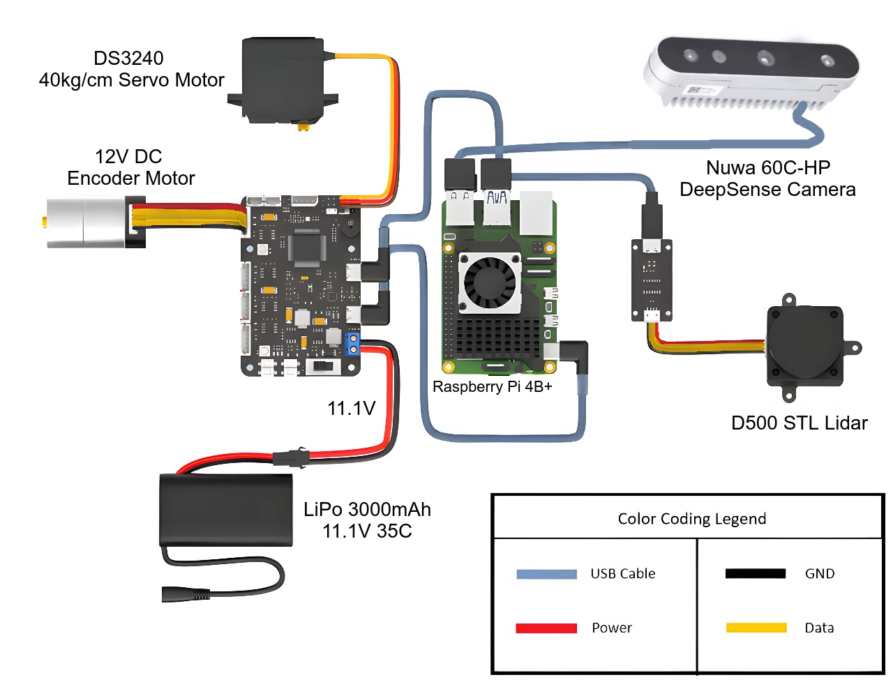
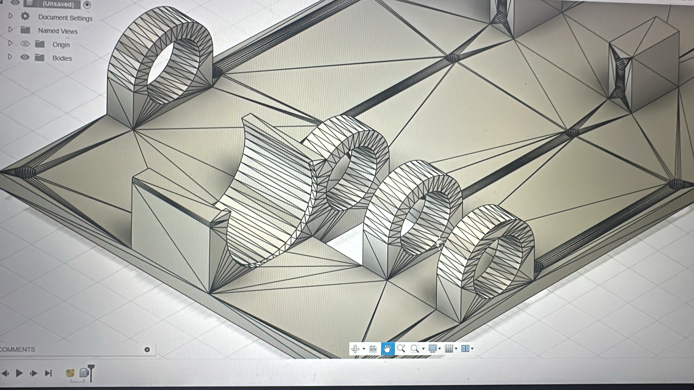
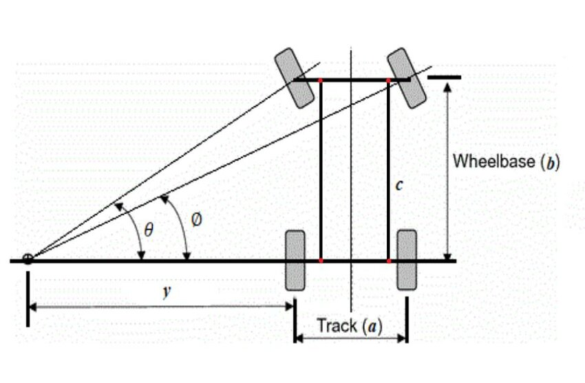
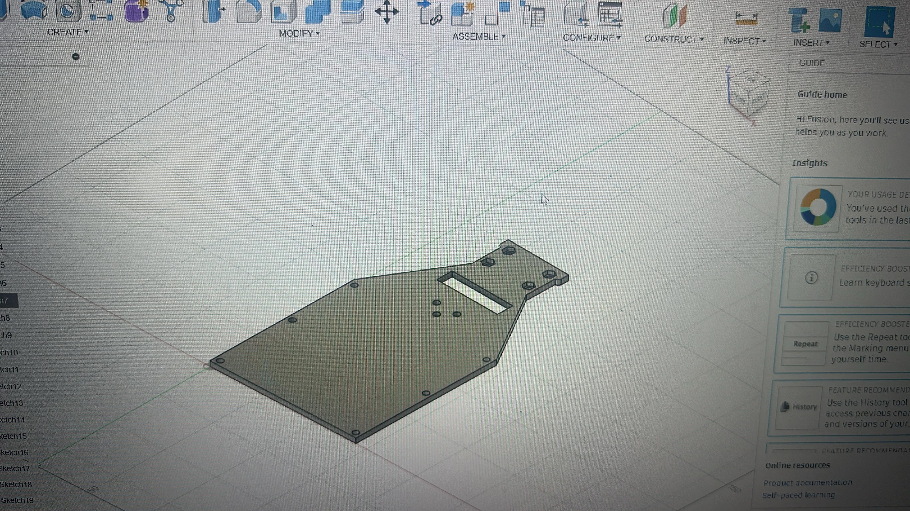
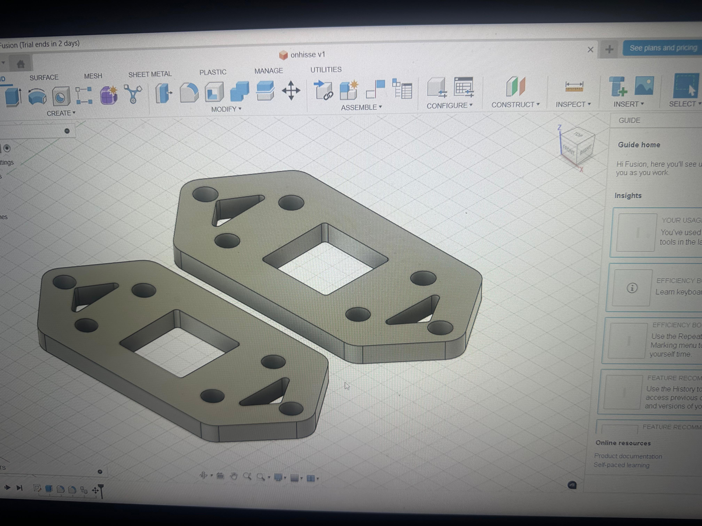
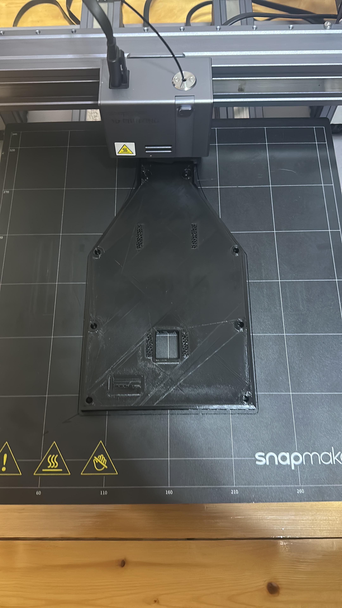
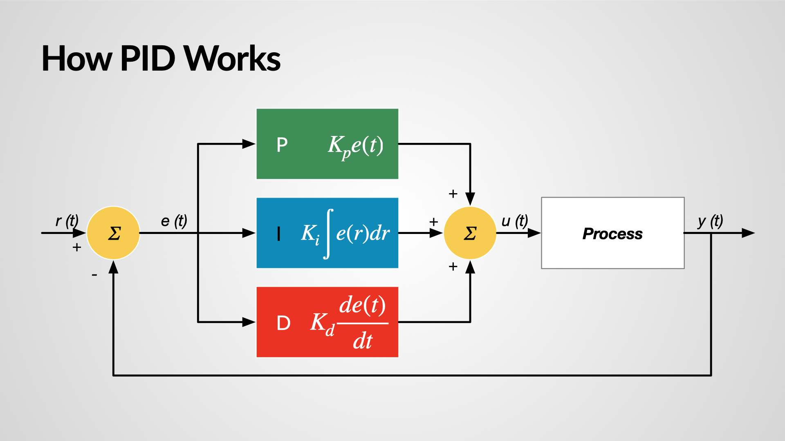
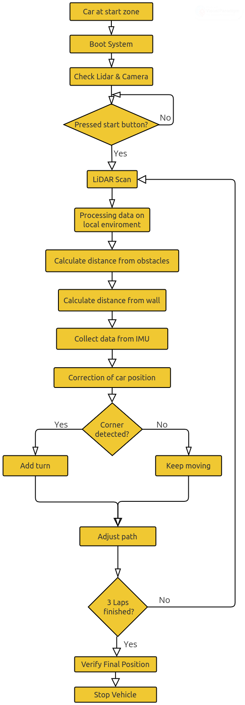

Village Boys – Azerbaijan
====

This repository presents the **Village Boys Team**'s self-driving car — **Hoqqa**, developed and programmed by our team from Azerbaijan for the **World Robot Olympiad™ 2025 – Future Engineers Category (Self-Driving Cars)**, under the theme *The Future of Robots*. Here, you'll find comprehensive details about our robot’s design, architecture, and features — a result of our team's commitment to pushing the boundaries of autonomous technologies and innovative robotics.

## List of Dictionaries

* [`List-of-Materials`](https://github.com/AlibaliAlibayov/WRO2025-FE-VillageBoys/tree/main/List-of-Materials) contains the list of all the materials necessary to build the robot.
* [`Team-Photos`](https://github.com/AlibaliAlibayov/WRO2025-FE-VillageBoys/tree/main/Team-Photos) contains multiple photos of the whole team.
* [`Vehicle-Models`](https://github.com/AlibaliAlibayov/WRO2025-FE-VillageBoys/tree/main/Vehicle-Models) contains multiple 3D models of the vehicle's view.
* [`Vehicle-Photos`](https://github.com/AlibaliAlibayov/WRO2025-FE-VillageBoys/tree/main/Vehicle-Photos) contains multiple photos of the vehicle.
* [`Vehicle-Schemes`](https://github.com/AlibaliAlibayov/WRO2025-FE-VillageBoys/tree/main/Vehicle-Schemes) contains the wiring diagrams of the whole robot including all of its components.
* [`src`](https://github.com/AlibaliAlibayov/WRO2025-FE-VillageBoys/tree/main/src) contains the main and other programs of the robot.
* [`videos`](https://github.com/AlibaliAlibayov/WRO2025-FE-VillageBoys/tree/main/src) contains 2 video links showcasing each challenge round.
  
## Content

- [1. Introduction](#1-introduction)
- [2. The Team](#2-the-team)
- [3. Robot Specifications](#3-mobility-management)
  - [3.1 Hoqqa Car’s Logic](#31-hoqqa-car’s-logic)
  - [3.2 Why Python?](#32-why-python?)
  - [3.3 Why ROS 2?](#33-why-ros-2?)
- [4. Mobility Management](#4-mobility-management)
  - [4.1 Wiring Diagram](#41-wiring-diagram)
  - [4.2 Motor Axle System](#42-motor-axle-system)
  - [4.3 Ackermann Steering System](#43-ackermann-steering-system)
- [5.  Power and Sense Management](#5-power-and-sense-management)
  - [5.1 Power Distribution Diagram](#51-power-distribution-diagram)
  - [5.2 Power Source](#51-power-source)
  - [5.3 Reasons for Using Our Sensors and Camera](#52-reasons-for-using-our-sensors-and-camera)
    - [5.3.1 D500 LiDar](#511-d500-lidar)
    - [5.3.2 Deepsense Camera](#512-deepsense-camera)
  - [5.4 Energy Comsumption Table](#52-energy-comsumption-table)
- [6. Building the Robot](#6-building-the-robot)
  - [6.1 Chassis](#61-chassis)
  - [6.2 Front Wheel System](#62-front-wheel-system)
  - [6.3 3D Printing Process](#63-3d-printing-process)
- [7. Principal Strategy](#7-principal-strategy)
  - [7.1 PID Controller](#71-pid-controller)
  - [7.2 Open Challenge](#72-open-challenge)
  - [7.3 Obstacle Challenge](#73-obstacle-challenge)


## 1. Introduction


 This engineering documentation offers a comprehensive overview of the **Village Boys Team's** self-driving robot, developed and programmed by our team from the Philippines for the **Future Engineers Category at the WRO Azerbaijan 2025 Local Finals**. Within this document, you'll find insights into the robot’s design, functionality, and features — all reflecting our dedication to advancing autonomous technology.

 The documentation highlights key aspects of the robot’s development, including:

 * **Mobility Management** – covering motor selection, chassis design, and assembly, all guided by principles of speed, torque, and power;
 * **Power and Sense Management** – detailing the power sources and sensor setup, supported by a wiring diagram and a full Bill of Materials (BOM);
 * **Obstacle Management** – outlining our navigation strategies through flow diagrams and code breakdowns.

 To complement the technical information, we've included visual documentation such as real and 3D model images of the robot from multiple angles, along with team photos. Additionally, performance videos showcase the robot in action across various challenge scenarios.


## 2. The Team

 Our team consists of three dedicated members, each bringing unique strengths and expertise to the table. As the _Village Boys Team_, our primary goal is to work with maximum efficiency while combining our individual skills to learn from one another and grow together. Through close collaboration, we aim not only to enhance our personal knowledge in robotics, AI, and embedded systems, but also to continuously improve the performance, intelligence, and reliability of our robot — _Hoqqa_. We believe that teamwork, curiosity, and perseverance are the key drivers behind our success in building a competitive and innovative autonomous vehicle.
  
  <p align="center">
    
  </p>

  **Alibali Alibayov** is a graduate of School No. 4 in the Aliabad settlement of the Zaqatala district. As a core contributor to the Hoqqa project, he focuses on the integration of the Raspberry Pi board with the ROS 2 framework, utilizing both a depth camera and LIDAR for real-time perception and decision-making. His primary objective is to ensure that the results achieved in simulation can be effectively and reliably applied in real-world scenarios, bridging the gap between virtual testing and physical performance.

  <p align="center">
    
  </p>
  
**Haji Hajiyev** is a graduate of the Zagatala City Lyceum named after Academician Zarifa Aliyeva. As a technical contributor to the Hoqqa project, he specializes in 3D modeling of the car’s components. His primary focus is on refining the digital model based on insights gained from physical testing. By analyzing real-world performance, he ensures that the design maintains both structural strength and aerodynamic efficiency, while continuously improving the mechanical layout of the vehicle.

  <p align="center">
    
  </p>
  
**Nihat Muradli** is a student at the European Azerbaijan School. As a technical contributor to the Hoqqa project, he focuses on refining the vehicle’s parts through simulation-driven design improvements. In addition to his design work, he is responsible for the electrical integration of the system, ensuring reliable communication between hardware components. He also manages the project documentation, aligning it with WRO standards to clearly present the team’s work and progress.


## 3. Robot Specifications

The Village Boys Team proudly presents our self-driving car — the Hoqqa robot, developed for the World Robot Olympiad Azerbaijan 2025 Local Finals. Designed with precision, agility, and performance in mind, Hoqqa reflects the innovation and strong collaboration of our trio. Engineered to meet the challenges of the competition, the robot features some significant sensors equipped with the **Nuwa HP60C Cam**,**Lidar** and **IMU** delivering optimal speed, maneuverability, and power efficiency.

Below, you'll find the key specifications that showcase Hoqqa’s capabilities — a testament to our team's dedication to excellence and readiness to compete on the competition.

  * **Dimensions:** 205mm (L) x 190mm (W) x 130mm (H)
  * **Weight:** 1.39kg
  * **Maximum Speed:** 6.53m/s
  * **Steering Torque:** 100Ncm
  * **Working Voltage:** 11.1V
  * **Drive System:** Rear-wheel drive (RWD)
  * **Steering Geometry:** Parallel steering

### 3.1 Hoqqa Car’s Logic

The Hoqqa system is built on **ROS 2**, which manages sensor integration, data processing, and control. At startup, the program initializes the **LIDAR**, the **Nuwa 60C-HP depth camera**, and variables for lap tracking and timing, before entering a continuous loop.

The LIDAR provides distance measurements to keep a safe margin from walls, while the depth camera supports lap counting and reference-point recognition on the circuit. Sensor data is continuously analyzed to adjust speed and steering, ensuring stable navigation.

During the Obstacle Challenge, the depth camera detects block colors to decide maneuvering:

* **Red** → pass on the right
* **Green** → pass on the left

At the same time, LIDAR maintains wall awareness for safe evasion. After completing the required laps and obstacle avoidance, Hoqqa searches for a suitable parking space and performs a parallel parking maneuver using distance and angle calculations from its sensors.


### 3.2 Why Python?

For the Hoqqa project, **Python** was chosen as the main programming language because it provides the perfect balance between flexibility, speed of development, and hardware control. Since our system relies on both real-time sensor data and complex decision-making, Python allows us to rapidly develop and refine algorithms while keeping the code clean and easy to maintain.

We benefit from Python in several ways:

* **Readable and efficient** → Python’s high-level syntax makes it easy to write, test, and debug, which is essential for rapid prototyping and adapting strategies during WRO preparation.
* **Extensive libraries** → From **ROS 2 integration**, computer vision, and AI tools to low-level hardware control on the Raspberry Pi, Python offers ready-to-use libraries that accelerate development.
* **Cross-platform use** → Python runs seamlessly on the Raspberry Pi, making it the ideal choice for tasks such as motor control, depth camera processing, and LIDAR data handling.
* **Flexibility in logic** → Advanced navigation, obstacle avoidance, and sensor fusion are easier to implement and adjust thanks to Python’s dynamic nature and strong support in the robotics community.

By combining these advantages, Python allows us to move quickly from simulation to real-world testing, making it the backbone of Hoqqa’s control system.

### 3.3 Why ROS 2?

For Hoqqa, we rely on **ROS 2 (Robot Operating System)** as the backbone of our software. ROS 2 is an open-source robotics framework that provides modular tools for sensor integration, navigation, and simulation. It has become a standard in robotics because it enables complex systems to be built in a flexible and scalable way.

We use ROS 2 for the following reasons:

* **Sensor and Actuator Integration** → ROS 2 allows us to connect the **Nuwa 60C-HP depth camera**, LIDAR, and motor controllers into a single coordinated system. Each sensor publishes data as topics, making it easy to synchronize perception and control.
* **Environmental Perception with LIDAR** → Using ROS 2 drivers and mapping packages, we process 360° distance data to detect obstacles and track walls. This real-time perception is essential for navigating the WRO track.
* **Autonomous Navigation and Path Planning** → With ROS 2 navigation tools, we combine depth camera and LIDAR data for decision-making. This enables dynamic path planning, especially during the **Obstacle Challenge**, where the car must react quickly to red or green blocks.
* **Simulation and Debugging** → ROS 2 integrates with **Gazebo** for simulation and **RViz** for real-time visualization. This allows us to test algorithms safely in a virtual environment before deploying them on the real car, reducing risk and speeding up development.

ROS 2 gives us a solid foundation to bridge simulation and real-world performance, making it an essential part of the Hoqqa project.

## 4. Mobility Management

Mobility is the core element of the Hoqqa project, as the car must navigate efficiently, adapt to track conditions, and complete tasks with stability. To achieve this, the chassis and key components were designed in **3D modeling software** and printed using **PLA**, a material that is lightweight, durable, and cost-effective. PLA provides enough strength for stability while keeping the vehicle light, which is ideal since our design does not aim for extreme speeds but rather for precise and reliable control.

The overall shape of Hoqqa is inspired by **formula-style cars**, with a low ground clearance that improves **road-holding** and reduces **aerodynamic drag**. This streamlined design helps the robot remain stable in turns and minimizes air resistance during movement.

An important design constraint was the placement of the **LIDAR sensor**. Since the competition walls are only 10 cm high, the LIDAR had to be positioned under this limit to ensure accurate scanning of the environment. Careful adjustment of its mounting allows Hoqqa to detect walls and obstacles reliably while still fitting within the official size requirements.

Finally, the **electronic components**—including motors, motor drivers, and sensors—were chosen specifically to maximize mobility. They provide enough torque and responsiveness for smooth navigation, enabling Hoqqa to combine precise control with efficient obstacle avoidance.

### 4.1. Wiring Diagram

  <p align="center">
    
  </p>

_* **Central Controller** → **Raspberry Pi 4B+**, which manages all sensors and actuators._
_* **Sensors**:_

  _* **Nuwa 60C-HP Depth Camera** → connected via USB for vision and depth perception._
  _* **D500 STL LiDAR** → connected via USB + power, used for wall detection and mapping._
_* **Motors**:_

  _* **12V DC Encoder Motor** → provides driving power, connected through a motor driver board._
  _* **DS3240 Servo Motor (40kg/cm)** → handles steering, also linked to the motor driver._
_* **Power Supply**:_

  _* **LiPo Battery (11.1V, 3000mAh, 35C)** → main power source for motors and controller board._
_* **Motor Driver Board** → distributes power and control signals between Raspberry Pi, motors, and sensors._
_* **Wiring**:_

  _* **Red = Power**, **Black = Ground**, **Yellow = Data**, **Blue = USB connections**._

_In short: the **LiPo battery powers the motor driver board**, which drives the motors, while the **Raspberry Pi (running ROS 2)** handles decision-making using input from the **depth camera and LiDAR**._

### 4.2. Motor Axle System

Hoqqa uses a single **12V 7.5 kg·cm, 170 RPM encoder motor** connected to a **26-tooth metal gear** that drives the rear axle. This configuration allows the rear wheels to efficiently support the weight of the car while providing smooth forward and backward movement. The gear ratio ensures better torque and control, improving stability during turns and reducing wear on the wheels. This design is especially important for maintaining precision and reliability on tight corners and variable track conditions.
  
  <p align="center">
    
  </p>

### 4.3. Ackermann Steering System

Hoqqa uses an **Ackermann steering system** controlled by a **15 kg·cm digital servo** for precise and stable navigation. This geometry aligns all wheels to a common center when turning, reducing tire slip and enabling smooth cornering. The high-torque servo ensures accurate, responsive steering, improving maneuverability and control on complex paths and obstacles.

  <p align="center">
    
  </p>

## 5. Power and Sense Management

### 5.1 Power Distribution Diagram
<p align = "center">

  </p>
  
### 5.2 Power Source
The battery powering the autonomous car is a ***Lithium Polymer (Li-poly)*** type with a capacity of 3000 mAh and a nominal voltage of 11.1V. This battery was chosen specifically to meet the energy demands of the system, providing enough power to run both the Raspberry Pi and the vehicle's motors simultaneously. With a discharge capacity of 20C, the battery ensures a consistent energy supply, which is essential for maintaining system performance in high-demand applications like autonomous operation and real-time data processing.
  
### 5.3 Reasons for Using Our Sensors and Camera
#### 5.3.1 D500 LiDar:
  + ***Precise environmental mapping***: With its ±10mm accuracy, the D500 enables precise positioning, essential for navigating narrow or intricate sections of the obstacle course. This allows our robot to make calculated movements without collisions or deviations.
  + ***Real-time obstacle avoidance***: With its fast sampling rate, the LiDAR can detect and react to obstacles dynamically, ensuring smoother movement through the course.
  + ***Enhanced performance in varied lighting***: Its high tolerance for ambient light up to 60,000 lux and ability to detect glass is essential, where lighting conditions vary. This feature ensures our robot maintains consistent performance, accurately detecting objects and avoiding potential pitfalls like transparent or shiny obstacles.

> [!IMPORTANT]
> **Placement:**
> It was positioned at an altitude of under 10 cm, so it is able to detect the walls of the path, which are also 10 cm high. This placement ensures the Lidar has a clear view of the obstacles while remaining unobstructed by other components. All other elements on the car were arranged to avoid blocking the Lidar’s line of sight.
> 

  
#### 5.3.2 Deepsense Camera:
  + ***Color detection***: Since graphical color detection is a core part of your project, the camera can precisely identify various colors on the course. This enables our robot to execute programmed actions based on specific color cues, which is crucial for the Obstacle challenge, which requires interaction with color-based objects.
  + ***Spatial awareness through data fusion***: When combining camera data with our sensor, the robot gains a richer understanding of its environment. The camera provides detailed visual context that complements other data sources, leading to a more informed and adaptable navigation strategy.
### 5.4 Energy Comsumption Table

<div align="center">

<table>
  <thead>
    <tr>
      <th>Component</th>
      <th>Current Consumption (mA)</th>
    </tr>
  </thead>
  <tbody>
    <tr><td><b>Lidar</b></td><td><b>290 mA</b></td></tr>
    <tr><td><b>Deepsense Camera</b></td><td><b>300 mA</b></td></tr>
    <tr><td><b>Servo Motor</b></td><td><b>653 mA</b></td></tr>
    <tr><td><b>Encoder Motor</b></td><td><b>450 mA</b></td></tr>
    <tr><td><b>RRC Lite Controller</b></td><td><b>340 mA</b></td></tr>
    <tr><td><b>Raspberry Pi 4</b></td><td><b>2300 mA</b></td></tr>
  </tbody>
</table>

</div>

## 6. Building the Robot

**This section covers the assembly and 3D design of our robot, highlighting three main components: the chassis, the front steering system, and the 3D printing process.**

### 6.1. Chassis

The base and upper casing of our robot were crafted from aluminum to provide a strong yet lightweight support structure for all components. The base is designed to securely mount the Raspberry Pi and support the weight of the vehicle’s systems, offering a stable foundation and balanced weight distribution, which is critical for overall stability. The upper casing houses the LiDAR sensor, ensuring it has an unobstructed view while protecting it from potential impacts and environmental factors.

For the main structural parts, we used PLA, chosen for its affordability and light weight. The components are specially designed to enhance mobility and road-holding, allowing the robot to move efficiently and maintain stability across different surfaces.


  <p align="center">
    
  </p>

### 6.2. Front Wheel System

The base and upper casing of our robot were crafted from aluminum to provide strong yet lightweight support for all components. The base securely mounts the Raspberry Pi and supports the vehicle’s systems, offering a stable foundation and balanced weight distribution. The upper casing houses the LiDAR sensor, ensuring an unobstructed view while protecting it from impacts and environmental factors.

For the main structural parts, we used PLA for its affordability and light weight. The components are specially designed for mobility and road-holding, creating a system that provides both strong structure and sufficient mobility for stable and efficient movement.

  <p align="center">
    
  </p>


### 6.3. 3D Printing Process

  <p align="center">
    
  </p>

## 7. Principal Strategy

### 7.1. PID Controller

A PID controller regulates a system by continuously comparing the desired target value (setpoint) with the current measured value and making adjustments based on three components:

* **Proportional (P):** Responds proportionally to the current error, providing an immediate correction.
* **Integral (I):** Accounts for accumulated past errors, helping to eliminate steady-state deviations.
* **Derivative (D):** Considers the rate at which the error is changing, smoothing the response and reducing overshoot.

By combining these three actions, a PID controller ensures the system reaches the desired target efficiently, maintaining stability and minimizing oscillations or delays.

  <p align="center">
    
  </p>

```
import cv2
import pytesseract
import time
from picamera2 import Picamera2
import numpy as nm
import RPlidar as Lidar
import sense._camera_deep as DSCamera
```

### 7.2. Open Challenge

For obstacle detection, we use the Follow The Gap algorithm, which takes advantage of the precise distance measurements from our LiDAR sensor. This method provides several benefits for our robot:

* **Improved Safety and Navigation:** Enables real-time obstacle avoidance with smooth path adjustments around detected objects, reducing the risk of collisions in complex environments.
* **Efficient Performance:** Requires low computational resources, allowing fast decision-making suitable for real-time control, while being simple to implement and reliably effective.

  <p align="center">
    
  </p>

```
import RPi.GPIO as GPIO
import mainControl
import time

SENSOR_PIN = 20 

my_sensor = line_sensor(SENSOR_PIN)

class LineFollowerPID_dl:
    def __init__(self, sensor_pins, motor_controller, Kp, Ki, Kd):
        self.sensor_pins = sensor_pins
        self.motor_controller = motor_controller
        self.Kp_dl = Kp
        self.Ki_dl = Ki
        self.Kd_dl = Kd

        GPIO.setmode(GPIO.BCM)
        for pin in self.sensor_pins:
            GPIO.setup(pin, GPIO.IN)
        
        self.previous_error = 0
        self.integral = 0
    
    def read_sensors(self):
        """Read the values from the 5 sensors (1 for black, 0 for white)."""
        return [GPIO.input(pin) for pin in self.sensor_pins]
    
    def calculate_error(self, sensor_values):
        """
        Calculate the error based on the sensor readings.
        Weights are adjusted assuming the line is 2 cm wide.
        """
        # Error weights assuming 2 cm per sensor coverage, centered on 0
        weights = [-2, -1, 0, 1, 2]

        # Error calculation: weighted sum of sensor values (1=black, 0=white)
        error = sum([weights[i] * sensor_values[i] for i in range(5)])

        # Normalize the error, so that maximum deviation from center is considered
        if sum(sensor_values) == 0:
            # If no sensor detects the line, keep the previous error (could be off track)
            error = self.previous_error
        else:
            error = error / sum(sensor_values)  # Normalize by the number of active sensors
        
        return error
    
    def pid_control(self, error, dt):
        """PID control logic for adjusting motor speeds."""
        P = error
        self.integral += error * dt
        derivative = (error - self.previous_error) / dt
        self.previous_error = error
        output = (self.Kp_dl * P) + (self.Ki_dl * self.integral) + (self.Kd_dl * derivative)
        return output
    
    def follow_line(self, base_speed=80):
        """Main loop for line following."""
        try:
            while True:
                start_time = time.time()
                sensor_values = self.read_sensors()
                error = self.calculate_error(sensor_values)
                dt = time.time() - start_time
                adjustment = self.pid_control(error, dt)
                
                # Motor speed adjustments
                left_speed = base_speed - adjustment
                right_speed = base_speed + adjustment
                left_speed = max(0, min(100, left_speed))
                right_speed = max(0, min(100, right_speed))
                
                # Set the motor speeds
                self.motor_controller.set_speed('left', left_speed)
                self.motor_controller.set_speed('right', right_speed)
                
                self.motor_controller.move_forward_both()
                
                time.sleep(0.1)
                
                # Check the single sensor
                sensor_value = my_sensor.read_line_sensor()
                
                if sensor_value == 0:
                    print("Black line detected by single sensor. Stopping the robot.")
                    self.motor_controller.stop_all()
                    break  # Stop following the line and break out of the loop

        except KeyboardInterrupt:
            self.motor_controller.stop_all()
            GPIO.cleanup()
```

```
# l298n_dual_motor.py

import RPi.GPIO as GPIO
import time

class L298NDualMotor:
    def __init__(self, left_pins, right_pins):
        """
        Initialize the motor control with specified GPIO pins.
        
        left_pins and right_pins should be dictionaries with keys:
        'in1', 'in2', 'en' (enable pin for PWM)
        """
        self.left_pins = left_pins
        self.right_pins = right_pins
        
        # Setup GPIO mode
        GPIO.setmode(GPIO.BCM)
        
        # Setup left motor pins
        GPIO.setup(self.left_pins['in1'], GPIO.OUT)
        GPIO.setup(self.left_pins['in2'], GPIO.OUT)
        GPIO.setup(self.left_pins['en'], GPIO.OUT)
        self.left_pwm = GPIO.PWM(self.left_pins['en'], 1000)
        self.left_pwm.start(0)
        
        # Setup right motor pins
        GPIO.setup(self.right_pins['in1'], GPIO.OUT)
        GPIO.setup(self.right_pins['in2'], GPIO.OUT)
        GPIO.setup(self.right_pins['en'], GPIO.OUT)
        self.right_pwm = GPIO.PWM(self.right_pins['en'], 1000)
        self.right_pwm.start(0)

    def set_speed(self, motor, speed):
        """ Set motor speed (0 to 100%). 'motor' can be 'left' or 'right'. """
        if motor == 'left':
            self.left_pwm.ChangeDutyCycle(speed)
        elif motor == 'right':
            self.right_pwm.ChangeDutyCycle(speed)
        else:
            raise ValueError("Motor must be 'left' or 'right'")

    def move_forward(self, motor):
        """ Move specified motor forward """
        if motor == 'left':
            GPIO.output(self.left_pins['in1'], GPIO.HIGH)
            GPIO.output(self.left_pins['in2'], GPIO.LOW)
        elif motor == 'right':
            GPIO.output(self.right_pins['in1'], GPIO.HIGH)
            GPIO.output(self.right_pins['in2'], GPIO.LOW)

    def move_backward(self, motor):
        """ Move specified motor backward """
        if motor == 'left':
            GPIO.output(self.left_pins['in1'], GPIO.LOW)
            GPIO.output(self.left_pins['in2'], GPIO.HIGH)
        elif motor == 'right':
            GPIO.output(self.right_pins['in1'], GPIO.LOW)
            GPIO.output(self.right_pins['in2'], GPIO.HIGH)

    def stop_motor(self, motor):
        GPIO.setmode(GPIO.BCM)
        """ Stop the specified motor """
        if motor == 'left':
            GPIO.output(self.left_pins['in1'], GPIO.LOW)
            GPIO.output(self.left_pins['in2'], GPIO.LOW)
        elif motor == 'right':
            GPIO.output(self.right_pins['in1'], GPIO.LOW)
            GPIO.output(self.right_pins['in2'], GPIO.LOW)

    def cleanup(self):
        """ Clean up GPIO settings """
        self.left_pwm.stop()
        self.right_pwm.stop()
        GPIO.cleanup()

    # Additional methods to control both motors together
    def move_forward_both(self):
        self.move_forward('left')
        self.move_forward('right')

    def move_backward_both(self):
        self.move_backward('left')
        self.move_backward('right')

    def stop_all(self):
        self.stop_motor('left')
        self.stop_motor('right')

    def set_speed_both(self, left_speed, right_speed):
        self.set_speed('left', left_speed)
        self.set_speed('right', right_speed)
```

### 7.3. Obstacle Challenge


The vehicle’s navigation system integrates LiDAR distance measurements with visual data from a monocular camera to handle obstacle detection and maneuvering. The camera detects the color of pillars along the vehicle’s path: a red pillar triggers a right turn, while a green pillar prompts a left turn. For obstacle avoidance, the LiDAR uses the Follow The Gap algorithm, which creates a safety bubble around the closest detected point, ignores points inside the bubble, and then identifies the largest free-space gap, steering the vehicle toward the furthest point in that gap. After performing color- or gap-based adjustments, the vehicle recalibrates its path to stay aligned with the planned navigation loop, combining real-time visual and spatial data for smooth, responsive, and efficient movement.

  <p align="center">
    
  </p>

